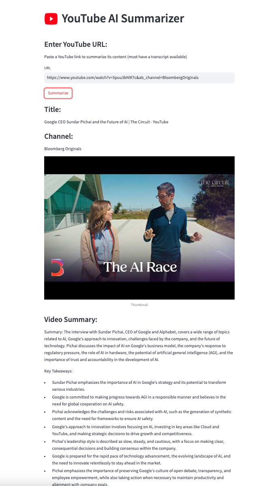

# YouTube AI Summarizer

Simple application to generate transcript summaries from YouTube Videos 

## Table of Contents

- [Installation](#installation)
- [Usage](#usage)

## Installation

### Using Conda

1. **Clone the repository:**
   ```bash
   git clone https://github.com/DavidYoo912/youtube_summarizer.git
   ```

2. **Navigate to the project directory:**
   ```bash
   cd youtube_summarizer
   ```

3. **Set up the Conda environment:**
   ```bash
   conda env create -f environment.yml
   ```

4. **Activate the environment:**
   ```bash
   conda activate <youtube_summarizer>
   ```

### Using pip

1. **Clone the repository:**
   ```bash
   git clone https://github.com/DavidYoo912/youtube_summarizer.git
   ```

2. **Navigate to the project directory:**
   ```bash
   cd youtube_summarizer
   ```

3. **Install dependencies with pip:**
   ```bash
   pip install -r requirements.txt
   ```

## Usage

After creating / activating the environment, run the following command to start the app 

```bash
   streamlit run app.py
   ```

Paste a YouTube link to summarize its content (must have a transcript available)


