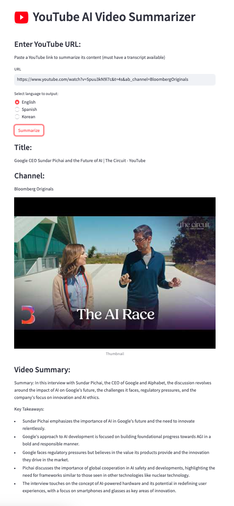

# AI YouTube Video Summarizer


Simple application to generate transcript summaries from YouTube Videos 

## Table of Contents

- [Installation](#installation)
- [Usage](#usage)

## Installation

### Using pip

1. **Clone the repository:**
   ```bash
   git clone https://github.com/DavidYoo912/youtube_summarizer.git
   ```

2. **Navigate to the project directory:**
   ```bash
   cd youtube_summarizer
   ```

3. **Install dependencies with pip:**
   ```bash
   pip install -r requirements.txt
   ```

## Usage

After installing requirements.txt, paste and export your OpenAI API key

```bash
   export OPENAI_API_KEY="your-api-key-here"
   ```

then, run the following command to start the app 

```bash
   streamlit run app.py
   ```

Paste a YouTube link to summarize its content (must have a transcript available)


